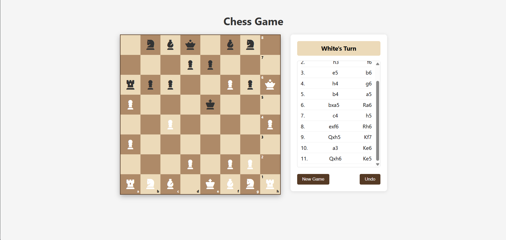

# ♟️ Chess Game

A fully functional chess game built with precision, clean architecture, and a deep respect for the rules and elegance of traditional chess. This project reflects both modern coding practices and timeless strategic gameplay.

[](https://github.com/Bhavu7/Chess---Game/stargazers)
[](https://github.com/Bhavu7/Chess---Game/blob/main/LICENSE)




---

## 🔍 Keywords

`chess game`, `JavaScript chess`, `open source chessboard`, `html chess game`, `vanilla js chess`, `2D chess UI`, `web-based chess game`, `build your own chess game`, `interactive chessboard js`

---

## 🚀 Features

- ✅ Classic 8x8 Chess Board
- ♟️ Legal move validation
- 🔄 Turn-based player system
- ♚ Check, Checkmate & Stalemate logic
- 🎨 Simple, clean, intuitive UI
- 💡 Designed with OOP principles / modular architecture
- 📦 Built for extensibility — AI, online multiplayer can be integrated later

---

## 🖥️ Tech Stack

| Layer        | Tech Used              |
|--------------|------------------------|
| Frontend     | HTML5, CSS3, JavaScript (ES6+) |
| Version Control | Git & GitHub         |

---

## 📸 Demo

Live At : [Play Game](https://bhavu7.github.io/Chess---Game/)

---

## 🛠️ Installation

Clone the repository:

```bash
git clone https://github.com/Bhavu7/Chess---Game.git
cd Chess---Game
